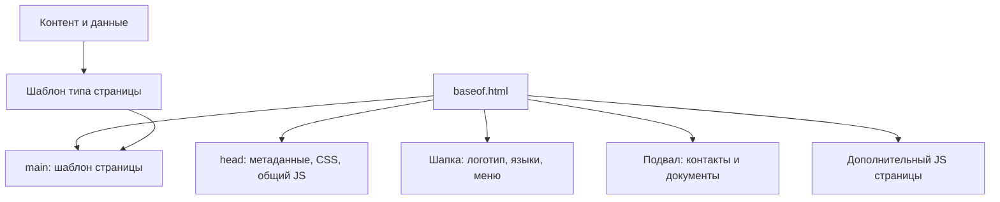
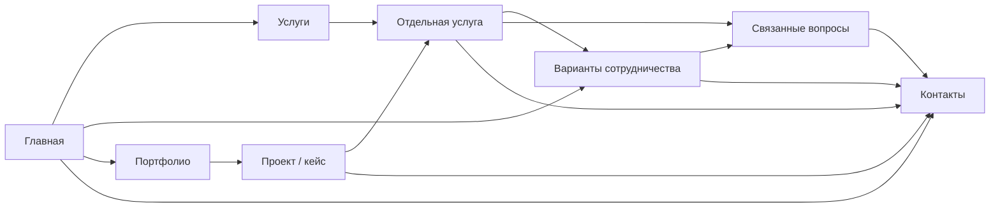

# Архитектура plus360

Анализ 2026-10-01. Изучены исходники и структура нескольких страниц, полученных с локального Hugo через Chrome DevTools MCP. Это анализ существующей реализации и предложение её развития; изменение структуры пока не выполнено. Стили рассматриваются на следующем этапе.

## 1. Общая оценка

Стек подходит для сайта услуг: Hugo генерирует страницы, браузерный JavaScript обслуживает небольшие интерактивные элементы, Cloudflare Pages публикует результат. Главная проблема — незавершённая модель контента и слабые связи между страницами. Общая оболочка уже выделена, но повторяющиеся смысловые блоки пока реализованы разными способами.

Нужно сохранить текущие основные маршруты, согласовать роли страниц, объединить повторяющиеся данные и завершить путь от услуги к обращению. Новый фреймворк, CMS или универсальный конструктор блоков для этого не требуются.

## 2. Слои реализации

| Слой | Реализация | Ответственность |
| --- | --- | --- |
| Конфигурация | `config/_default/` | Домен, языки, контакты, тема, обработка Markdown |
| Контент страниц | `content/` | Заголовки, описания, основное содержимое, меню и порядок страниц |
| Общие данные | `data/pricing.json`, `data/faq.de.json`, `data/faq.ru.json` | Тарифы и вопросы |
| Переводы интерфейса | `i18n/*.toml` | Подписи и сообщения, сейчас также большая часть условий тарифов |
| Шаблоны | тема: `layouts/` | Сборка страниц из контента и данных |
| Компоненты | тема: `_partials/`, `_shortcodes/` | Оболочка, заголовок страницы, карточки, диалоги |
| Поведение | тема: `assets/js/` | Меню, бегущая строка, диалоги, форма |
| Публикация | Cloudflare Pages | Раздача готовых файлов; почтовый обработчик пока отсутствует |

Тема — самостоятельный Git submodule. Это имеет смысл, если она действительно развивается как отдельный продукт или используется ещё где-то. Пока в ней смешаны общие компоненты и специфические для plus360 тарифы, услуги, FAQ и контакты. Это не блокирует запуск, но усложняет изменения: коммит темы и обновление её ссылки в сайте — две отдельные операции. Перенос/отказ от submodule требует отдельного решения; сейчас его менять не предлагается.

## 3. Карта страниц и выбор шаблонов

Немецкая версия в корне, русские переводы под `/ru/`.

| Маршрут | Контент | Шаблон темы | Роль |
| --- | --- | --- | --- |
| `/` | `_index.md` | `home.html` | Представить предложение и направить клиента |
| `/services/` | `services/_index.md` | `services/list.html` | Каталог направлений |
| `/services/<service>/` | `services/<service>/index.md` | `services/single.html` | Объяснить отдельную услугу |
| `/portfolio/` | `portfolio/_index.md` | `portfolio/list.html` | Показать опыт и результаты |
| `/portfolio/web-sites/`, `/portfolio/apps/` | вложенные `_index.md` | `portfolio/list.html` | Категории работ |
| `/price/` | `price/index.md` + pricing + i18n | `price/single.html` | Выбор способа сотрудничества |
| `/faq/` | `faq/index.md` + FAQ JSON | `faq/single.html` | Ответить на вопросы перед обращением |
| `/contact/` | `contact/index.md`, `type: contacts` | `contacts/single.html` | Принять обращение |
| `/impressum/`, `/privacy/`, `/agb/` | соответствующие `index.md` | `single.html` | Служебные документы |

Каталоги с `_index.md` являются разделами Hugo, с `index.md` — отдельными страницами. Поэтому категории портфолио сейчас обслуживаются списочным шаблоном; `portfolio/single.html` предназначен для будущих страниц проектов и сейчас не участвует в показе существующих ссылок на проекты.

У контактов имя маршрута `contact`, а имя типа `contacts`. Это допустимо, но соглашение нужно описать или упростить. В FAQ `type: faq` совпадает с каталогом и сейчас избыточен. Меню задано в front matter страниц, `menu.toml` пуст. Такой подход можно сохранить, исправив опечатки `idetifier` и введя стабильные идентификаторы.

## 4. Общая оболочка и блоки

`baseof.html` задаёт оболочку и точки расширения `main` и `page-scripts`. Это хорошая основа. Общий JS подключается ко всем страницам, JS формы — только к контактам.

`common/page-header.html` используется в услугах, тарифах, FAQ и портфолио. Но компонент одновременно выводит заголовок, подзаголовок и весь `.Content`; название скрывает его реальную ответственность. Весь контент заключён в `
`, хотя Markdown уже создаёт абзацы и другие блочные элементы. Предлагается ограничить компонент заголовком и коротким вводным текстом, а основной контент выводить отдельно.

Главная, отдельная услуга, контакты и обычная страница создают собственные варианты заголовка и контентной оболочки. Это основной источник будущих расхождений структуры и стилей. Перед работой над стилями нужен общий каркас заголовка, вводного текста, содержимого и завершающего CTA.

Существуют три разных вида карточек: icon-card на главной, service-card в каталоге, page-card для проектов. Семантически это разные сущности; их не нужно превращать в один универсальный компонент. Нужно унифицировать общие правила и определить данные каждого вида.

Shortcodes `cards-grid` и `icon-card` связаны между собой: карточка получает размер иконки от родителя, а родитель внедряет SVG sprite. Главная собирается вручную в Markdown из этих shortcodes. Это удобно для небольшого количества блоков, но список услуг оказывается отдельной копией каталога.

## 5. Роли и состав страниц

### Главная

Сейчас: заголовок → обещание → семь услуг → ссылка на цены → строка технологий → пять преимуществ → три этапа работы → предложение связаться.

Недостатки: карточки услуг без ссылок; контакты в финальном блоке не кликабельны; нет примеров работ; нет краткого выбора трёх моделей сотрудничества. Главная описывает предложение, но мало помогает выбрать следующий шаг.

Предлагаемый состав: предложение и CTA → направления услуг → модели сотрудничества → избранные работы → процесс → преимущества/подтверждения → короткий FAQ → CTA. Это перечень смысловых блоков, а не обязательство увеличить страницу: каждый блок должен быть коротким и иметь конкретную задачу.

### Услуги

Каталог формируется из `.Pages.ByWeight`: заголовок, Summary, изображение и цена от `price_from`. Главная содержит семь направлений, каталог — шесть: обновление контактов отдельно показано только на главной. Лучше включить его в обновление контента и использовать шесть согласованных направлений.

Отдельная услуга сейчас состоит из H1 и нескольких абзацев. Subtitle, scope, результат и следующий шаг шаблоном не предусмотрены; внизу — соседние услуги и ссылка на каталог с `+++`.

Предлагаемый состав подробной услуги: краткое объяснение → типичные задачи → что входит → результат → процесс/ограничения → подходящие модели оплаты → релевантная работа или FAQ → CTA с названием выбранной услуги. Переходы к соседним услугам вторичны.

Не нужно заводить новые страницы для каждого мелкого действия. Добавлять отдельное направление стоит только при самостоятельном предложении и достаточном содержимом.

### Цены / варианты сотрудничества

Сейчас: абонементы → почасовая ставка → примеры задач → пакеты часов → исключения → CTA. Отдельного блока индивидуальной оценки нет, вводный текст говорит о двух моделях, хотя согласованы три.

Предлагаемый состав: краткое сравнение трёх моделей → индивидуальная оценка → почасовые работы и примеры → три абонемента → общие условия/исключения → CTA и релевантный FAQ. Пакеты часов — дополнение к почасовой модели.

Числа распределены между `pricing.json`, front matter услуг и переводами: часы, сроки ответа, скидки и оценки задач частично зашиты в ключах и текстах i18n. Для финального утверждения цен нужна единая модель числовых условий; переводы должны подставлять значения в сообщения. Иначе изменение срока или часов требует ручного согласования нескольких мест.

Выбранная услуга или план сейчас не передаются в контакты. Рекомендуется простой параметр URL и необязательное поле интересующей услуги/модели, без системы оформления заказов.

### Портфолио

Сейчас корневая страница вставляет содержимое дочерних категорий напрямую. У категорий нет страниц проектов; поэтому портфолио — список внешних ссылок. Категории существуют как отдельные URL, но корень не выводит ссылки на них: блок включается через `.Params.Categories`, которого нет в front matter.

Шаблон уже содержит обход вложенных проектов и page-card, но данных для них нет. Если проекты появятся, текущая ветка списка категории покажет карточки без явной группировки; корень также нужно собирать по явно выбранным работам, а не по наличию вложенных `.Pages`.

Предлагаемая модель: проект как `index.md` с ресурсами изображений, краткой задачей, выполненной работой, результатом, ссылкой и связанными услугами. Корень показывает выбранные кейсы, категории фильтруют/группируют их. Не каждому проекту нужен большой кейс: допускается компактная карточка. Новые подробные страницы оправданы наличием содержимого.

### FAQ

26 вопросов в каждой языковой версии. Категории уже записаны в JSON, но шаблон их игнорирует и выводит длинный плоский список. Subtitle выводится дважды: в page-header и над списком.

Предлагается сгруппировать вопросы по имеющимся категориям, дать краткую навигацию и выбирать связанные вопросы для услуг/тарифов по стабильным ID. Одна запись должна быть источником текста и для полного FAQ, и для выборок, и для JSON-LD.

FAQ упоминает клиентский портал, которого в этой кодовой базе нет. Это не основание строить портал: нужно уточнить фактический процесс и привести тексты к нему.

### Контакты и документы

Контакты — конечная точка клиентского пути. Нужен контекст заявки и понятные состояния формы; подключение почты отложено владельцем. Контактный блок может переиспользоваться как ссылка/CTA, сама форма пока нужна только на одной странице.

Документы используют блоговый `single.html`: дата, количество слов, соседние документы. Для служебных страниц полезнее простой заголовок и содержимое; дату обновления показывать только при необходимости. Автоматическую навигацию Prev/Next между документами убрать из целевой структуры.

## 6. Связи между страницами

Это целевые связи. Сейчас надёжно работает глобальное меню и каталог → отдельная услуга; FAQ содержит ссылки на цены/контакты. Главная не связывает карточки с услугами, подробные услуги не связывают пользователя с тарифами/контактами, тарифные CTA обрываются на `#`. Кейсов и их связей с услугами пока нет.

Русские главная и вводный FAQ принудительно ссылаются на немецкие страницы. Внутренние маршруты следует получать из страниц Hugo в нужном языке, а не хранить их как произвольные строки. Отсутствие перевода документов нужно обрабатывать явно.

## 7. Предлагаемые границы компонентов и данных

Сначала выделить только реально повторяющиеся блоки:

- Заголовок страницы и короткое вступление.
- Карточка услуги, сетка услуг; источник — страницы услуг и их метаданные.
- CTA: текст, действие, целевая страница, контекст услуги/плана.
- Карточка проекта, список/выборка работ; источник — проектные страницы.
- FAQ item / FAQ group / выборка; источник — FAQ с ID.
- Блок процесса и блок моделей сотрудничества, если они появляются на нескольких страницах.
- Тарифные секции по отдельным partials, с общей моделью условий.

Длинный текст услуги хранить в Markdown; краткий заголовок, summary, icon и порядок — в front matter. Не копировать каталог услуг в отдельный JSON. Общие числовые условия сотрудничества — в pricing data. Подписи — в i18n. Для FAQ нужны стабильные ID и ссылки на категории/услуги; для проектов — связанные услуги по стабильным ID страниц.

Общий JS остаётся небольшим. `window.CONFIG` создаёт неявную зависимость скриптов формы от общего bundle; при подключении отправки лучше передать endpoint явно через форму/конфигурацию модуля. Диалог можно сохранить общим, форму — отдельным модулем. Сохранившиеся panorama shortcodes и пустой back-to-top не относятся к текущему клиентскому пути; их наличие не требует возвращать эти функции в продукт.

## 8. Порядок архитектурных изменений

1. Согласовать роли страниц и перечисленные целевые блоки; сохранить основные URL.
2. Определить единую модель услуг, моделей оплаты, FAQ и проектов.
3. Унифицировать page-header, содержимое, CTA и внутренние ссылки; упростить служебный шаблон.
4. Связать главную с услугами; услуги, цены и портфолио — с контактами. Добавить индивидуальную модель сотрудничества.
5. Разделить монолитный тарифный шаблон на смысловые секции; сгруппировать FAQ и исправить структуру портфолио.
6. Перейти к консистентности стилей уже на определённом наборе блоков.

Числа и почтовый сервис остаются отложенными решениями. В рамках архитектурного анализа исходники реализации не менялись.

## Обновление: общий заголовок и FAQ

`common/page-header.html` теперь выводит семантический header с одним H1, подзаголовком-абзацем и `.Content` внутри div. Markdown не оборачивается повторно в p. Вводный контент сохранён для существующих потребителей: FAQ, каталог услуг, тарифы и портфолио. Общая типографика и отступы используют дизайн-токены, выравнивание по левому краю и ограниченную длину строки.

FAQ использует один отсортированный набор данных `data/faq.<lang>.json` для видимых вопросов и JSON-LD. Существующие категории задают разделы с H2 и навигацию по якорям; вопросы — нативные details/summary с H3, без клиентского accordion и обязательного JavaScript. Ответы Markdown выводятся в div, поэтому абзацы, списки и ссылки остаются корректными. Несколько ответов можно открыть одновременно. JSON-LD FAQPage безопасно сериализуется encoding.Jsonify; Google больше не показывает FAQ rich results, разметка сохраняется как описание содержимого.

На широких экранах навигация по темам находится справа и остаётся sticky с верхним отступом; при нехватке высоты она прокручивается внутри своей области. Вопросы находятся слева; ниже 1100 px используется одна колонка. Финальное обращение ведёт на контакты текущего языка. FAQ проверена в Chrome на 320, 768 и 1440 px, на обоих языках, с текстом 200%, увеличенными интервалами и клавиатурным раскрытием; production Hugo/Sass сборка проходит. Полный аудит скринридерами не проводился. Тексты ответов ещё требуют отдельной редакторской проверки: в них встречаются обещания клиентского портала, сроков и условий обслуживания, которые нельзя считать подтверждёнными готовностью интерфейса.
